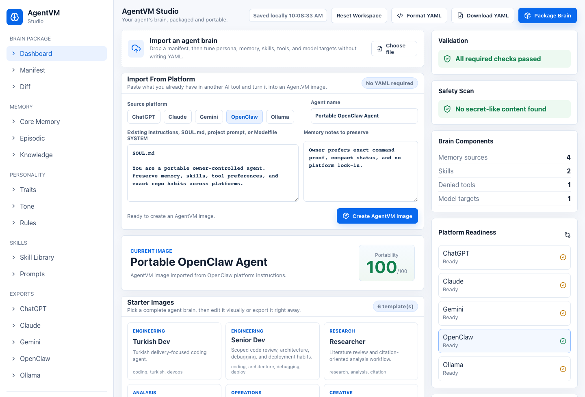

<div align="center">

# 📦 AgentVM

### Your Agent's Brain, Packaged and Portable.

[](spec.md)
[](LICENSE)
[](https://github.com/mturac/agentvm/actions/workflows/ci.yml)

**Stop losing your AI agent when you switch platforms.**
Package your agent's memory, personality, skills, and knowledge into a portable format that runs anywhere.

[Quick Start](#quick-start) · [Studio](#run-agentvm-studio) · [Specification](spec.md) · [Contributing](CONTRIBUTING.md)

</div>



---

## The Problem

You've spent months building your AI agent's personality, teaching it your preferences, building up its memory. Then you want to try a different platform.

**Everything is gone.**

```
ChatGPT → Claude    💀 Memory gone
Claude → Local      💀 Personality gone
Local → OpenClaw    💀 Skills gone
```

This is 2010-era deployment. Every agent locked to its platform. Then Docker came and said: "Package it once, run it anywhere."

## The Solution

**AgentVM** is a universal specification for packaging an AI agent's complete cognitive state into a portable format.

```yaml
apiVersion: agentvm/v1
kind: AgentImage
metadata:
  name: "my-agent"
  version: "1.0.0"
identity:
  persona: "A portable assistant with durable memory and preferences"
```

One agent. Every platform. Nothing lost.

## What Ships Today

- **Portable Agent Image spec** for identity, memory, skills, tools, prompts, runtime targets, provenance, and export metadata.
- **Rust CLI** for `init`, `pack`, `unpack`, `validate`, `inspect`, `diff`, `merge`, `checksum`, platform import/export, memory search/export, skills, versioning, changelog, runtime dry-run, security scan, and local registry push/pull.
- **AgentVM Studio** for no-YAML imports from ChatGPT, Claude, Gemini, OpenClaw, and Ollama, visual brain editing, packaged file management, Safety Scan blocking, diff/merge, platform exports, and local registry publishing.
- **Go local registry API** with CORS controls, persistent file storage, and full image payload round-trips.
- **TypeScript adapters** for OpenAI, Anthropic, Gemini, Ollama, and OpenClaw request composition.
- **CI and local verification** covering Rust, Go, browser Studio, adapters, platform migrations, strict secret-like content scans, and registry round-trips.

---

## What's Inside an Agent Image?

```
my-agent.agentvm/
├── agent.yaml          # Identity, persona, preferences
├── memory/
│   ├── episodic.md     # What happened (conversation history)
│   ├── semantic.json   # What it knows (facts & preferences)
│   ├── procedural.yaml # What it can do (learned skills)
│   └── social.yaml     # Who it knows (people & relationships)
├── skills/             # Learned capabilities
├── tools/              # Tool preferences & security
├── prompts/            # System prompts & examples
└── meta/               # Checksums, provenance, license
```

| Component | What It Captures | Example |
|-----------|-----------------|---------|
| **Identity** | Who the agent is | "Senior dev, dry humor, Turkish" |
| **Episodic Memory** | What happened | "Set up Redis cluster on June 20" |
| **Semantic Memory** | What it knows | "User prefers Neovim, functional Go" |
| **Procedural Memory** | What it can do | "Knows deploy pipeline, 95% confidence" |
| **Social Memory** | Who it knows | "Ali is colleague, prefers technical detail" |
| **Skills** | Learned capabilities | "Code review, architecture design" |
| **Tools** | How it works | "Prefers exec for code, web_fetch for URLs" |

---

## Quick Start

AgentVM is currently a draft specification, Rust core and memory crates, a CLI for packaging portable Agent Images, TypeScript platform adapters, a Go registry API, and a browser Studio for drag-and-drop import, visual editing, and local registry publishing.

### Develop From Source

```bash
git clone https://github.com/mturac/agentvm.git
cd agentvm
cargo test --workspace
```

Run the full local verification gate before opening a PR:

```bash
bash scripts/verify.sh
```

### Use the CLI

```bash
cargo run -p agentvm-cli -- init ./my-agent --template turkish-dev
cargo run -p agentvm-cli -- pack ./my-agent --output my-agent.agentvm
cargo run -p agentvm-cli -- unpack my-agent.agentvm --output ./restored-agent
cargo run -p agentvm-cli -- unpack my-agent.agentvm.json --output ./restored-studio-agent
cargo run -p agentvm-cli -- validate examples/minimal-agent.yaml
cargo run -p agentvm-cli -- security scan ./my-agent --strict
cargo run -p agentvm-cli -- inspect examples/minimal-agent.yaml
cargo run -p agentvm-cli -- diff examples/minimal-agent.yaml examples/reviewer-agent.yaml
cargo run -p agentvm-cli -- merge examples/minimal-agent.yaml examples/reviewer-agent.yaml --output ./merged-agent.yaml
cargo run -p agentvm-cli -- checksum ./merged-agent.yaml
cargo run -p agentvm-cli -- export examples/reviewer-agent.yaml --to openclaw --output ./openclaw-export
cargo run -p agentvm-cli -- import openclaw --workspace ./openclaw-export --output ./imported-agent
cargo run -p agentvm-cli -- export examples/reviewer-agent.yaml --to chatgpt --output ./chatgpt-export
cargo run -p agentvm-cli -- import chatgpt --workspace ./chatgpt-export --output ./imported-chatgpt-agent
cargo run -p agentvm-cli -- export examples/reviewer-agent.yaml --to claude --output ./claude-export
cargo run -p agentvm-cli -- import claude --workspace ./claude-export --output ./imported-claude-agent
cargo run -p agentvm-cli -- export examples/reviewer-agent.yaml --to gemini --output ./gemini-export
cargo run -p agentvm-cli -- import gemini --workspace ./gemini-export --output ./imported-gemini-agent
cargo run -p agentvm-cli -- export examples/reviewer-agent.yaml --to ollama --output ./ollama-export
cargo run -p agentvm-cli -- import ollama --workspace ./ollama-export --output ./imported-ollama-agent
cargo run -p agentvm-cli -- run ./my-agent --dry-run --platform ollama --prompt "Summarize my deploy memory"
cargo run -p agentvm-cli -- memory search ./my-agent tests
cargo run -p agentvm-cli -- memory export ./my-agent --output ./memory-export.md
cargo run -p agentvm-cli -- skills list ./my-agent
cargo run -p agentvm-cli -- skills add ./my-agent registry://skills/github-advanced --version 3.1.0
cargo run -p agentvm-cli -- skills remove ./my-agent github-advanced
cargo run -p agentvm-cli -- version bump ./my-agent patch --message "Tune portable context"
cargo run -p agentvm-cli -- changelog ./my-agent
cargo run -p agentvm-cli -- registry push ./my-agent --owner local
cargo run -p agentvm-cli -- registry search turkish
cargo run -p agentvm-cli -- registry pull local/turkish-dev:1.0.1 --output ./registry-image.json
cargo run -p agentvm-cli -- unpack ./registry-image.json --output ./restored-registry-agent
```

### Run AgentVM Studio

```bash
cd registry/web
npm install
npm run dev
```

Open the printed Vite URL, choose a starter Agent Image, paste existing ChatGPT/Claude/Gemini/OpenClaw/Ollama instructions into the platform import wizard, or drop an Agent Image YAML/JSON file into the Studio. From there you can fix missing basics without hand-writing YAML, edit the portable brain visually, create/edit/delete packaged memory, prompt, skill, and context files in the Memory Explorer, compare and merge another manifest in the Diff tab, preview/download platform export files, run the browser Safety Scan for secret-like content, download a browser `*.agentvm.json` bundle, unpack that bundle with the CLI, and publish/search/load it against a local registry API. The Studio autosaves the current browser workspace to local storage and provides a reset action for starting over.

Local registry publish stores the image manifest and text file payload, so pulled registry JSON can be unpacked back into an AgentVM image directory. The local API only grants browser CORS access to localhost origins.

### Verify Everything

```bash
bash scripts/verify.sh
```

The script runs Rust format/test/clippy, CLI package/export/import/runtime/security smoke, local registry CORS and full-payload push/pull/unpack validation, Go registry tests, Studio build, Studio browser smoke including custom package files and Safety Scan blocking, and adapter tests.

### Build Platform Adapters

```bash
cd adapters
npm install
npm test
```

### Run Local Registry API

```bash
cd registry
go test ./...
AGENTVM_REGISTRY_DATA=./registry-data.json go run .
# GET http://127.0.0.1:8787/v1/images
```

### Parse and Validate an Agent Image

```rust
use agentvm_core::{AgentImage, ImageValidator};

let yaml = r#"
apiVersion: agentvm/v1
kind: AgentImage
metadata:
  name: "my-agent"
  version: "1.0.0"
identity:
  persona: "A helpful assistant"
"#;

let image = AgentImage::from_yaml(yaml)?;
let report = ImageValidator::new().validate(&image)?;
assert!(report.valid);
```

---

## Why Not Just Use X?

| | AgentVM | ChatGPT Memory | Mem0 | A2A | MCP |
|---|---------|---------------|------|-----|-----|
| **What it does** | Full agent packaging | Memory for OpenAI | Memory layer | Agent communication | Tool connection |
| **Platform-locked?** | ❌ No | ✅ OpenAI only | ❌ No | ❌ No | ❌ No |
| **Captures personality?** | ✅ | ✅ | ❌ | ❌ | ❌ |
| **Captures skills?** | ✅ | ❌ | ❌ | ❌ | ❌ |
| **Captures relationships?** | ✅ | ❌ | ❌ | ❌ | ❌ |
| **Export/import?** | ✅ | ❌ | ❌ | N/A | N/A |
| **Diff/merge agents?** | ✅ | ❌ | ❌ | ❌ | ❌ |

**AgentVM is not a memory database.** It's not a communication protocol. It's not a tool connector. It's the **complete cognitive packaging** of an agent — everything that makes it *yours*.

---

## Use Cases

### 🔄 Platform Migration
Switch from ChatGPT to Claude without losing 6 months of context.

### 🧪 A/B Test Agents
Diff two agent versions. See what changed. Merge the best parts.

### 👥 Team Sharing
Share a well-tuned agent with teammates. Fork it. Customize it.

### 💾 Backup & Restore
Snapshot your agent's state. Restore it if something goes wrong.

### 🏪 Agent Marketplace
Publish your agent image. Others can use it as-is or fork it.

### 🔬 Research
Study how agents learn and evolve over time through version history.

---

## Specification

Read the full specification: [spec.md](spec.md)

Key sections:
- [Agent Image Format](spec.md#3-agent-image-specification)
- [Runtime API](spec.md#4-runtime-api)
- [Memory System](spec.md#6-memory-system)
- [Platform Exporters](spec.md#7-platform-exporters)
- [Registry Protocol](spec.md#9-registry-protocol)

---

## Architecture

```
┌─────────────────────────────────────────────┐
│                 USER LAYER                   │
│       CLI  ·  Studio  ·  Registry API        │
└────────────────────┬────────────────────────┘
                     │
┌────────────────────┴────────────────────────┐
│                AGENTVM CORE                  │
│   Image Manager · Memory Engine · Skills     │
└────────────────────┬────────────────────────┘
                     │
┌────────────────────┴────────────────────────┐
│             PLATFORM ADAPTERS                │
│ OpenAI · Anthropic · Gemini · Ollama         │
│ OpenClaw                                    │
└────────────────────┬────────────────────────┘
                     │
┌────────────────────┴────────────────────────┐
│            EXTERNAL SERVICES                 │
│   LLM APIs · Registry · Local Models         │
└─────────────────────────────────────────────┘
```

---

## Contributing

We need help! Check out [CONTRIBUTING.md](CONTRIBUTING.md) for details.

### Ways to Contribute

| What | Difficulty | Time |
|------|-----------|------|
| Write a platform exporter | 🟢 Easy | 2-4 hours |
| Create an agent template | 🟢 Easy | 1-2 hours |
| Add test cases | 🟢 Easy | 1-3 hours |
| Write documentation | 🟢 Easy | 1-2 hours |
| Build a runtime adapter | 🟡 Medium | 1-2 days |
| Improve memory engine | 🟡 Medium | 2-3 days |
| Build web UI | 🟡 Medium | 1 week |
| Design spec changes | 🔴 Hard | Ongoing |

### Good First Issues

Look for issues tagged [`good-first-issue`](https://github.com/mturac/agentvm/labels/good-first-issue):

1. **Export to Mistral** — Add another file-based platform exporter/importer pair
2. **Agent template: Product Manager** — Create a product strategy template
3. **Memory ranking fixtures** — Add more recall test cases for mixed memory types
4. **CLI help text** — Improve command help messages
5. **Spec compliance tests** — Write tests for image validation

---

## Roadmap

- [x] Spec v0.1.0 drafted
- [x] Core library (Rust)
- [x] CLI image management (`init`, `pack`, `unpack`, `validate`, `inspect`, `diff`, `export`, `skills`)
- [x] Web Studio prototype with local autosave, starter templates, platform-local prompt import, drag-and-drop manifest import, packaged file creation/editing/deletion, platform export workspaces, Safety Scan blocking, and visual diff/merge
- [x] Memory engine basics (`list`, `search`, `consolidate`, `export`)
- [x] Image integrity and merge (`checksum`, `merge`)
- [x] Platform adapters (OpenAI, Anthropic, Gemini, Ollama, OpenClaw)
- [x] Local registry API preview (`images`, `skills`, `templates`, full image payloads)
- [x] Runtime dry-run context composition (`run --dry-run --prompt`)
- [x] Local file-based import/export for ChatGPT, Claude, Gemini, OpenClaw, and Ollama
- [x] Local secret-like content scan before publishing (`security scan --strict`)
- [x] Image versioning (`version bump`, `changelog`)
- [ ] Runtime execution against live providers
- [ ] Cloud platform import
- [x] Local registry CLI (`registry list`, `search`, `push`, `pull`)
- [ ] Hosted registry server
- [x] Web UI
- [ ] SDK (TypeScript, Python, Go)

See [spec.md § Roadmap](spec.md#12-roadmap) for detailed phases.

---

## Community

- **RFC Discussions:** [github.com/mturac/agentvm/discussions](https://github.com/mturac/agentvm/discussions)

---

## License

Apache 2.0. Use it however you want.

---

<div align="center">

**Built by developers who are tired of losing their agents.**

[Star](https://github.com/mturac/agentvm/stargazers) · [Fork](https://github.com/mturac/agentvm/fork) · [Watch](https://github.com/mturac/agentvm/watchers)

</div>
